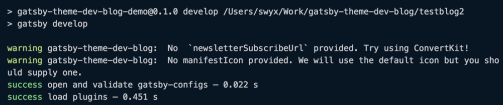

I continue to hack on `gatsby-theme-dev-blog`.

> 💁🏼‍All code here can be seen in [the `gatsby-theme-dev-blog` source code](https://github.com/sw-yx/gatsby-theme-dev-blog)

> 📺 This was also [livestreamed with commentary on Youtube](https://www.youtube.com/watch?v=FxKhVu4yWMI).

## Passing options into a Gatsby Theme

My [initial attempt](/hello-world) was fairly successful, but left a lot of stuff that needed customization because Dan hardcoded a lot of his personal information. You can pass in customization data from the top level gatsby project (aka consumer of the gatsby theme) into themes by overriding `siteMetadata`, but also you can pass in options into the theme:

```js
// gatsby-config.js for the top level consumer of the gatsby theme
module.exports = {
{
  // misc stuff here
  __experimentalThemes: [
    {
      resolve: "gatsby-theme-dev-blog",
      options: {
        trackingId: "UA-YOURNUMBERHERE-1",
        RSSFeedTitle: `swyx's blog RSS Feed`,
        BlogName: `swyx.io blog`,
        BlogShortName: `swyx.io`,
      },
    },
  ],
}
```

## Retrieving options inside a Gatsby Theme

you'll have to set up your gatsby themes to receive these options by converting your theme's `gatsby-config.js` from exporting an object to exporting a function:

```js
// gatsby-config.js for your gatsby theme
module.exports = config => {
  // // some code here
  // `config` is an object with options passed in from the top level consumer of the theme, eg per the above it is equal to
  // {
  //  trackingId: "UA-YOURNUMBERHERE-1",
  //  RSSFeedTitle: `swyx's blog RSS Feed`,
  //  BlogName: `swyx.io blog`,
  //  BlogShortName: `swyx.io`,
  //}
  return {
    // what you would normally return here
  }
}
```

## Providing Defaults for a Gatsby Theme Options with Override Warning

It is a choice to error or not if configs are not required. I've chosen the most lenient policy, so I provide defaults for all my options, but this makes it easier to ignore which may not be what you want for your user. up to you.

```js
// gatsby-config.js for your gatsby theme
function validate(
  config,
  fieldName,
  defaultValue,
  missingMessage = `No ${fieldName} provided!`
) {
  if (!config[fieldName]) {
    console.warn("gatsby-theme-dev-blog: ", missingMessage)
    config[fieldName] = defaultValue
  }
}

module.exports = config => {
  validate(
    config,
    "newsletterSubscribeUrl",
    `https://app.convertkit.com/forms/812047/subscriptions`,
    `No  \`newsletterSubscribeUrl\` provided. Try using ConvertKit!`
  )
  // etc...

  return {
    // some code that uses `config.newsletterSubscribeUrl`
  }
}
```

If you use `console.warn`, Gatsby's logging makes it look pretty nice:



## Querying data with StaticQuery

So now you can use this user supplied theme options data anywhere in your theme's `gatsby-config.js`, for example inside of the plugins used inside the theme:

```js
{
  resolve: `gatsby-plugin-google-analytics`,
  options: {
    trackingId: config.trackingId,
  },
},
```

or inside `siteMetadata` itself:

```js
siteMetadata: {
  // ...
  newsletterSubscribeUrl: config.newsletterSubscribeUrl,
  // ...
},
```

so now I can query this inside one of my components:

```js
// src/components/Signup.js
import { StaticQuery, graphql } from 'gatsby'

const query = graphql`
  query signupSiteMetadata {
    site {
      siteMetadata {
        newsletterSubscribeUrl
      }
    }
  }
`

class Signup extends React.Component {
  render() {
    return (
      <StaticQuery
        query={query}
        render={data => {
          const { siteMetadata } = data.site
          return (
            <form
              action={siteMetadata.newsletterSubscribeUrl
              // ...
```

I've done modifications like this all over so that my theme is truly customizable and doesn't fully depend on Dan's personal info.
